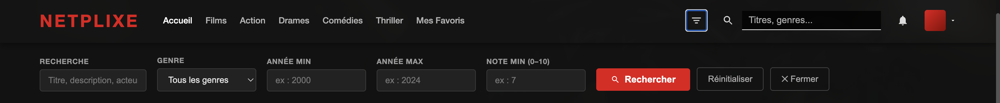
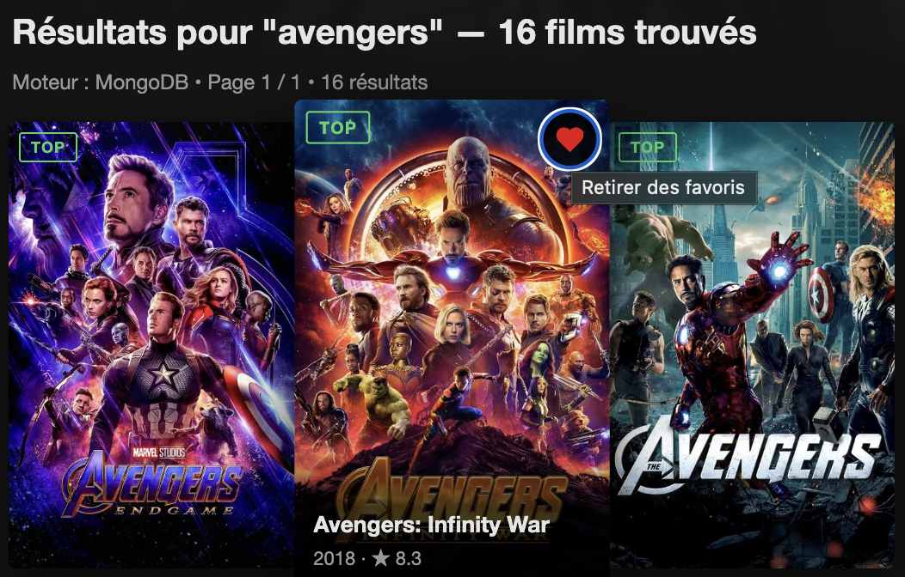
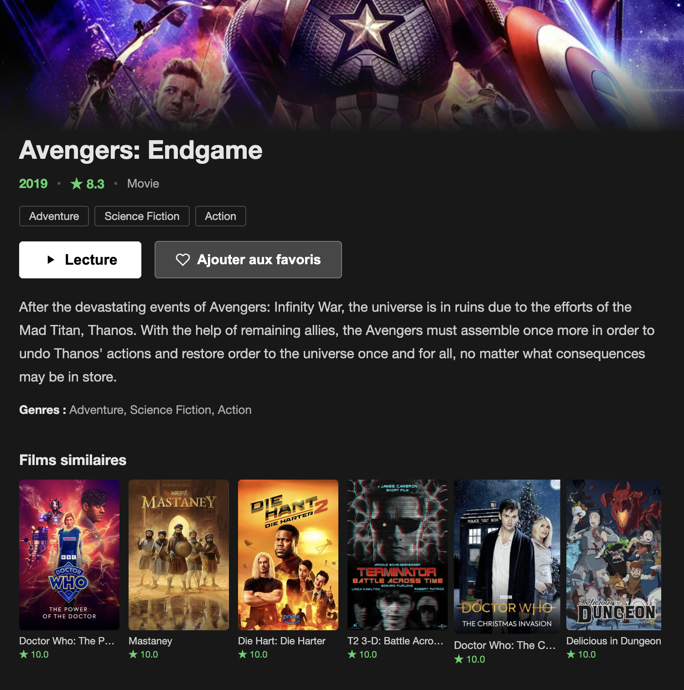
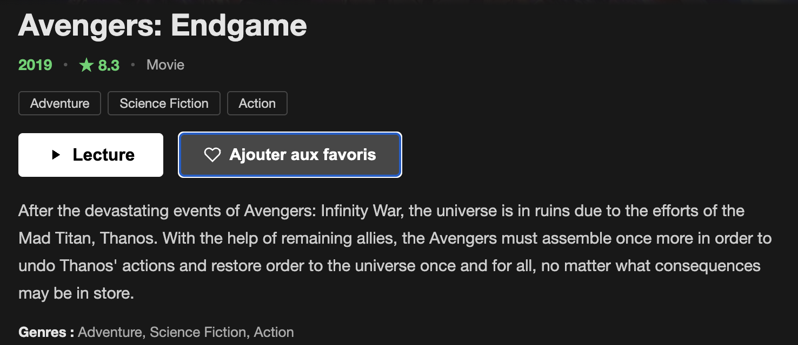
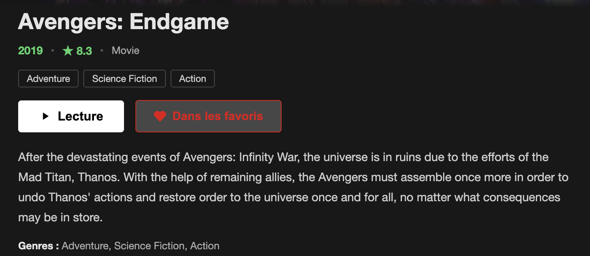
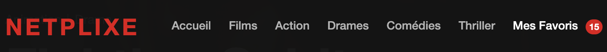

# 🎬 Netplixe

Netplixe is a Netflix-inspired movie catalogue built as a complete data-oriented web application. The platform lets users browse a dynamic catalogue of more than **25,000 movies**, search instantly, filter results with an advanced search panel, open rich movie detail pages, save favorites, and discover similar movies.

The goal of this project was not only to build a nice frontend. Netplixe was designed as a full application architecture with a separated frontend, a FastAPI backend, MongoDB persistence, Redis caching, Elasticsearch search, Docker images, and Kubernetes deployment through Minikube.

This project was created for the **LU3IN403 / Outils pour les Sciences des Données** project, where the main objective was to design, implement, containerize, and deploy a modern web application based on real data and HTTP APIs.

## 🧰 Technologies

- `HTML`
- `CSS`
- `JavaScript`
- `Python`
- `FastAPI`
- `MongoDB`
- `Redis`
- `Elasticsearch`
- `Docker`
- `Kubernetes`
- `Minikube`
- `NGINX Ingress`
- `Bash`

## ✨ Features

Here is what Netplixe can do:

- **🎞️ Dynamic Movie Catalogue:** The backend imports a TMDB/IMDb dataset containing around 25,000 movies into MongoDB.

- **🏠 Netflix-Style Homepage:** The frontend displays a large hero section, horizontal movie rows, poster cards, badges, ratings, and a dark streaming-style interface.

- **🔎 Instant Search:** Users can search movies by title, description, or genre.

- **🎛️ Advanced Search:** The advanced panel supports keyword search, genre filtering, minimum year, maximum year, and minimum rating.

- **⚡ Elasticsearch Search Engine:** Advanced search uses Elasticsearch when available, with a MongoDB fallback if Elasticsearch is not ready.

- **🧠 Similar Movie Recommendations:** Each movie detail modal shows similar movies based on shared genres and rating.

- **❤️ Favorites System:** Users can add or remove movies from favorites. Favorite IDs are stored in `localStorage`, then resolved through the backend.

- **📄 Movie Details Modal:** Each movie has a detail view with poster artwork, title, year, rating, type, genres, overview, and related movies.

- **📦 Redis Cache:** Backend responses are cached with Redis to speed up repeated catalogue, search, stats, and recommendation requests.

- **🐳 Dockerized Services:** Frontend, backend, MongoDB, Redis, and Elasticsearch are all containerized.

- **☸️ Kubernetes Deployment:** The project includes Kubernetes manifests for deployments, services, config, secrets, namespace, and ingress.

- **🟢 One-Command Startup:** The `start.sh` script starts Minikube, builds images, applies Kubernetes manifests, restarts deployments, and prepares the `netflix.local` entry.

## 🧪 The Process

We started from the project requirement: create a web application based on real data, with a clear frontend/backend/database architecture and a deployable containerized setup.

The first technical choice was the data source. Instead of relying on a live external API, we used a TMDB/IMDb CSV dataset and imported it into MongoDB. This made the project more reliable during demos because the catalogue is available locally inside our infrastructure.

Next, we built the backend with FastAPI. The API exposes endpoints for catalogue pagination, simple search, advanced search, favorites, statistics, movie details, and similar movie recommendations. MongoDB is the source of truth, Redis improves repeated requests, and Elasticsearch powers richer search when it is available.

After the API was working, we built the frontend as a Netflix-style single-page interface using HTML, CSS, and JavaScript. The interface consumes the backend through HTTP, renders movie rows, opens detail modals, stores favorites in the browser, and displays advanced search results.

Finally, we focused on deployment. Each component was containerized with Docker, then deployed to Kubernetes with Minikube. The application is exposed through `netflix.local`, with `/api` routed to FastAPI and `/` routed to the frontend.

## 📚 What I Learned

**🧩 Architecture matters:**  
This project helped us understand how a real web application is split into independent services: frontend, backend API, database, cache, search engine, and ingress.

**🗃️ Data preparation is part of the product:**  
The CSV dataset had to be cleaned, normalized, imported, indexed, and mapped into fields the frontend could use easily.

**⚡ Caching and search engines solve different problems:**  
Redis improves repeated requests, while Elasticsearch improves search relevance and filtering. Both were useful, but for different reasons.

**☸️ Kubernetes makes deployment explicit:**  
Writing deployments, services, config maps, secrets, and ingress files made the infrastructure easier to understand and reproduce.

**🧯 Fallbacks are important:**  
The backend can still use MongoDB search if Elasticsearch is unavailable, so the application remains usable even when an optional service is still starting.

**🧑‍💻 Developer experience matters:**  
The `start.sh` script turns many manual deployment steps into one command, which makes the project easier to run, test, and present.

## 🚧 How It Can Be Improved

- 🔐 Add user authentication instead of storing favorites only in `localStorage`.
- 🎬 Add trailers or streaming links inside the movie detail modal.
- 📊 Add a dashboard page with catalogue statistics and charts.
- 🧪 Add automated backend tests for the FastAPI routes.
- 🧭 Add end-to-end tests for the main frontend workflows.
- 📝 Add CI/CD for Docker image builds and Kubernetes deployment.
- 📱 Improve the responsive design for small mobile screens.
- ⭐ Add collaborative filtering or content-based recommendations beyond shared genres.
- 🌍 Add language, country, and runtime filters.
- 🚀 Deploy the project on a remote Kubernetes cluster instead of only Minikube.

## 🎬 Quick Demo

This demo shows the main workflow of Netplixe: browsing the catalogue, searching for a movie, opening details, adding favorites, and reviewing the favorites page.

### 1. Open the home page

When the platform opens, the user lands on a Netflix-style home page. The hero section highlights one movie with its genres, year, rating, description, and action buttons.

<p align="center">
  
</p>

### 2. Browse popular and trending rows

The homepage contains horizontal rows such as **Populaire sur Netplixe** and **Tendances actuelles**. Each card displays poster artwork and badges such as `TOP` or `NOUVEAU`.

<p align="center">
  
</p>

### 3. Explore category rows

Users can continue scrolling through curated sections like **À voir absolument**, **Action & Aventure**, and **Drames & Émotions**. The top navigation can also filter by categories such as films, action, dramas, comedies, and thrillers.

<p align="center">
  
</p>

### 4. View the Top 10 section

The interface also includes a **Top 10 Aujourd'hui** row with large ranking numbers behind the posters, giving the page a more realistic streaming-platform feel.

<p align="center">
  
</p>

### 5. Open advanced search

By clicking the filter icon in the navbar, users can open the advanced search panel. This panel supports a query field, genre selector, minimum year, maximum year, and minimum rating.

<p align="center">
  
</p>

### 6. Search for a movie

In this example, the user searches for **avengers**. The backend returns matching movies and the frontend displays the total number of results, the active engine, pagination information, and matching cards.

<p align="center">
  
</p>

### 7. Open a movie detail modal

Clicking a result opens a detail modal. The modal shows the movie artwork, title, release year, rating, type, genre tags, overview, favorite button, and similar movies.

<p align="center">
  
</p>

### 8. Review details and similar movies

The detail view also recommends similar movies based on shared genres. This creates a simple discovery loop: the user can open one movie, inspect it, then continue exploring related content.

<p align="center">
  
</p>

### 9. Add a movie to favorites

The user can click **Ajouter aux favoris** from the modal. Favorites are saved in the browser and synchronized with the UI.

<p align="center">
  
</p>

### 10. Confirm favorite state

After the movie is added, the button changes to **Dans les favoris** with a red heart. This confirms that the movie has been saved.

<p align="center">
  
</p>

### 11. Check the favorites counter

The navbar displays a badge next to **Mes Favoris**. This badge updates whenever the user adds or removes a movie.

<p align="center">
  
</p>

### 12. Open the favorites page

The **Mes Favoris** section displays all saved movies in a grid. Users can remove movies from this page by clicking the heart button again.

<p align="center">
  
</p>

## 🏗️ Architecture

Netplixe is organized around five main services:

| Layer | Role |
|---|---|
| Frontend | Static HTML/CSS/JS interface served by NGINX |
| Backend | FastAPI REST API for catalogue, search, favorites, stats, and recommendations |
| MongoDB | Main database containing imported movie documents |
| Redis | Cache for repeated API responses |
| Elasticsearch | Advanced search engine with MongoDB fallback |

In Kubernetes, the ingress routes:

- `http://netflix.local/` to the frontend service.
- `http://netflix.local/api/...` to the FastAPI backend service.

## 🔌 API Overview

The backend exposes these main routes:

| Method | Route | Description |
|---|---|---|
| `GET` | `/health` | Checks API, catalogue size, Redis, and Elasticsearch status |
| `GET` | `/shows` | Returns paginated movies with optional type, genre, and sorting |
| `GET` | `/shows/search` | Performs simple MongoDB search |
| `GET` | `/shows/search/advanced` | Performs advanced Elasticsearch search with MongoDB fallback |
| `POST` | `/shows/favorites` | Returns movie documents for favorite IDs |
| `GET` | `/shows/stats` | Returns catalogue statistics |
| `GET` | `/shows/{show_id}` | Returns one movie by MongoDB ID |
| `GET` | `/shows/{show_id}/similar` | Returns similar movies based on genres |

## 🚀 Running the Project

### Prerequisites

Before running the project, install:

- `Docker`
- `Minikube`
- `kubectl`

### One-command Kubernetes deployment

From the root of the project, run:

```bash
./start.sh
```

The script will:

1. Check that `minikube`, `docker`, and `kubectl` are installed.
2. Start the Minikube cluster.
3. Enable the ingress addon.
4. Add `netflix.local` to `/etc/hosts`.
5. Build the backend and frontend Docker images inside Minikube.
6. Apply all Kubernetes manifests from `k8s/`.
7. Restart the backend and frontend deployments.
8. Wait for MongoDB, backend, frontend, Redis, and Elasticsearch.
9. Print the final browser URL.

On macOS, keep a second terminal open and run:

```bash
minikube tunnel
```

Then open:

```txt
http://netflix.local
```

The API is available through:

```txt
http://netflix.local/api
```

## 📁 Project Structure

```txt
Netplix-main/
├── backend/
│   ├── data/tmdb_imdb.csv
│   ├── database.py
│   ├── import_data.py
│   ├── main.py
│   └── requirements.txt
├── frontend/
│   ├── index.html
│   ├── script.js
│   └── style.css
├── k8s/
│   ├── *-deployment.yaml
│   ├── *-service.yaml
│   ├── configmap.yaml
│   ├── ingress.yaml
│   ├── namespace.yaml
│   └── secret.yaml
├── docs/
│   ├── assets/
│   └── files/Rapport_Netplixe.pdf
├── docker-compose.yml
├── start.sh
└── README.md
```

## 📄 Project Report

The full detailed report is available here:

[Open the Netplixe PDF report](docs/files/Rapport_Netplixe.pdf)

It explains the project context, architecture choices, data source, implementation, Docker/Kubernetes deployment, and final result in more detail.
